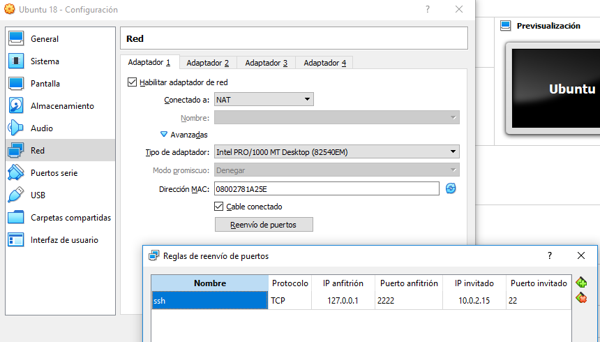

# Oracle VM VirtualBox

## Acceder por ssh

1. Instalar el servidor de ssh en la imagen: ```sudo apt-get install ssh```

2. Configurar el adaptador de red, añadiendo un mapeo de puertos entre la máquina hosts y la máquina virtual. Para acceder por ssh hay que configurar el puerto 22 de la máquina virtual. La ip de la máquina virtual se puede sacar desde la consola con el comando ifconfig


3. Acceder por línea de comando con el comando ```ssh <user>@localhost -p <port>```
